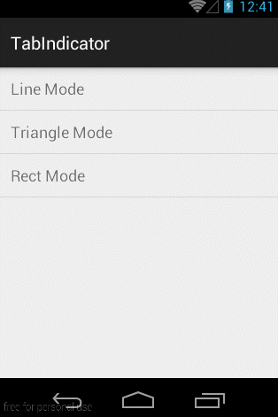
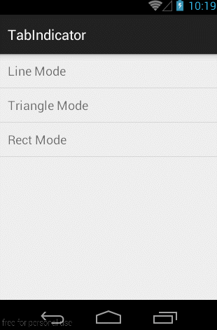
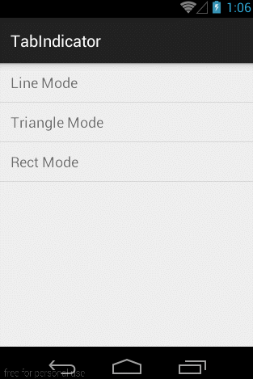

# __Android TabIndicator__

__TabIndicator is an Open Source Android library.__


 &nbsp;
 &nbsp;



## Usage
For a working implementation of this project see the __`sample/`__ folder.

* Include this widgets in your view. This should usually be placed adjacent to the __ViewPager__ it represents.
  
    ```
    <org.itheima.tabindicator.library.TabIndicator
        android:id="@+id/indicator"
        android:layout_width="match_parent"
        android:layout_height="wrap_content"
        itheima:tabMode="line"
        itheima:lineColor="#0000ff"
        itheima:lineStyle="wrap"
        itheima:lineHeight="8dp"
        />
    ```
    
* In your __onCreate__ method (or onCreateView for a fragment), bind the indicator to the __ViewPager__.
    
    ```
     //Set the pager with an adapter
     ViewPager pager = (ViewPager)findViewById(R.id.pager);
     pager.setAdapter(new TestAdapter());    
     //Bind the title indicator to the adapter
     TabIndicator indicator = (TabIndicator)findViewById(R.id.indicator);
     indicator.setViewPager(pager);
    ```

* (Optional) If you use an OnPageChangeListener with your view pager,

  > solution 1:
    ```
    indicator.setOnPageChangeListener(listener);
    ```

  > solution 2:
    ```
    indicator.addOnPageChangeListener(listener);
    ```
    
## Documentation

* __custom Attributions__
    ```xml
    <attr name="tiTabPaddingLeft" format="dimension"/>
    <attr name="tiTabPaddingRight" format="dimension"/>
    <attr name="tiTabPaddingTop" format="dimension"/>
    <attr name="tiTabPaddingBottom" format="dimension"/>

    <attr name="tiTabBackground" format="reference"/>
    <attr name="tiTabTextColor" format="reference|color"/>
    <attr name="tiTabTextSize" format="dimension"/>
    <attr name="tiTabTextBlod" format="boolean"/>

    <attr name="tiUnderLineHeight" format="dimension"/>
    <attr name="tiUnderLineColor" format="color"/>

    <!-- tab indicator mode -->
    <attr name="tiTabMode" format="enum">
        <enum name="line" value="0"/>
        <enum name="triangle" value="1"/>
        <enum name="rect" value="2"/>
    </attr>

    <!-- line mode attrs -->
    <attr name="tiLineHeight" format="dimension"/>
    <attr name="tiLineColor" format="color"/>
    <attr name="tiLineStyle" format="enum">
        <enum name="match" value="0"/>
        <enum name="wrap" value="1"/>
    </attr>

    <!-- triangle mode attrs -->
    <attr name="tiTriangleHeight" format="dimension"/>
    <attr name="tiTriangleWidth" format="dimension"/>
    <attr name="tiTriangleColor" format="color"/>
    <attr name="tiTriangleStyle" format="enum">
        <enum name="fill" value="0"/>
        <enum name="stroke" value="1"/>
    </attr>
    <attr name="tiTriangleStrokeWidth" format="dimension"/>

    <!-- rect mode attrs -->
    <attr name="tiRectPaddingLeft" format="dimension"/>
    <attr name="tiRectPaddingTop" format="dimension"/>
    <attr name="tiRectPaddingRight" format="dimension"/>
    <attr name="tiRectPaddingBottom" format="dimension"/>
    <attr name="tiRectColor" format="color"/>
    <attr name="tiRectRadius" format="dimension"/>
    <attr name="tiRectStyle" format="enum">
        <enum name="fill" value="0"/>
        <enum name="stroke" value="1"/>
    </attr>
    <attr name="tiRectStrokeWidth" format="dimension"/>
    <attr name="tiRectStrokeColor" format="color"/>
    ```

* __Tab Mode__
	```xml
	<!-- tab indicator mode -->
    <attr name="tiTabMode" format="enum">
        <enum name="line" value="0"/>
        <enum name="triangle" value="1"/>
        <enum name="rect" value="2"/>
    </attr>
	```